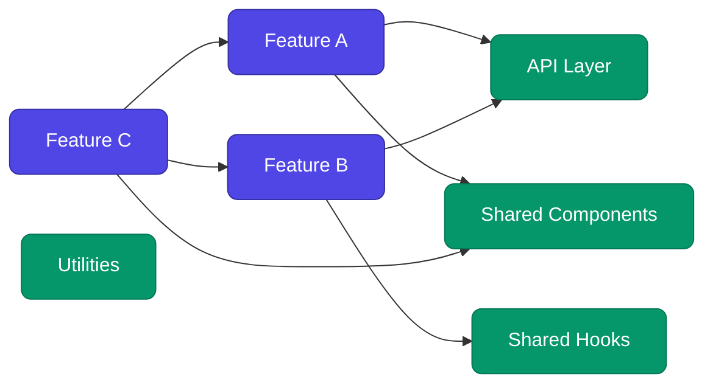
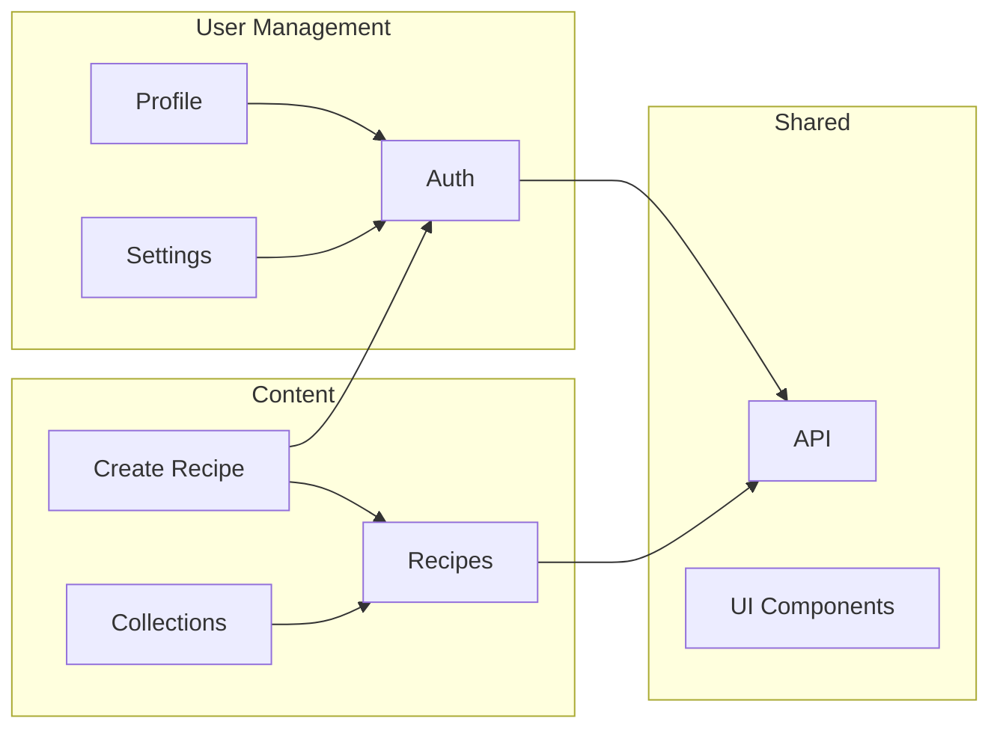
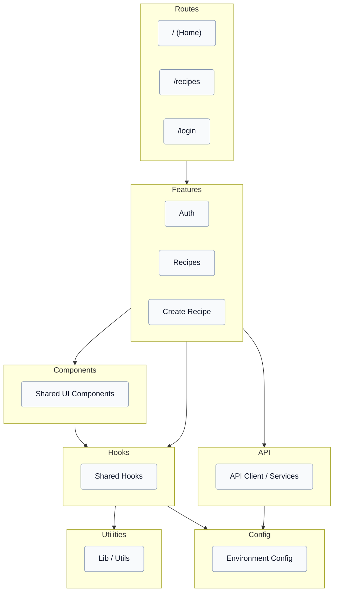
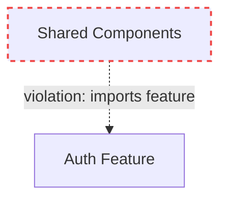

# Diagram Generation

## Table of Contents

1. [Mermaid Basics](#mermaid-basics)
2. [Feature Dependency Graph](#feature-dependency-graph)
3. [Architecture Layers Diagram](#architecture-layers-diagram)
4. [Styling Guidelines](#styling-guidelines)
5. [Drawing Diagrams in PDF with react-pdf SVG](#drawing-diagrams-in-pdf-with-react-pdf-svg)

---

## Mermaid Basics

All diagrams use [Mermaid](https://mermaid.js.org/) syntax. Mermaid renders in
GitHub Markdown, many documentation tools, and can be converted to images via
the Mermaid CLI (`mmdc`) or online renderers.

Key syntax rules:

- Node IDs must be alphanumeric (no spaces, use camelCase or underscores)
- Use `-->` for directed edges, `---` for undirected
- Use `subgraph ... end` for grouping
- Use `classDef` and `class` for styling
- Wrap labels in square brackets `[Label]` or quotes `["Label with spaces"]`

---

## Feature Dependency Graph

### Purpose

Show how features depend on each other and on shared modules. Helps identify:

- Tightly coupled features
- Central shared modules (high fan-in)
- Isolated features (candidates for lazy loading)
- Circular dependencies

### Template



### Adaptation Rules

1. Create one node per feature found in Step 3.
2. Create one node per shared module directory.
3. Add an edge for every cross-feature or feature-to-shared import found.
4. Omit edges to `node_modules` (external packages) — those go in the tech stack
   table instead.
5. If a feature has no outgoing dependencies, still include it as an isolated node.
6. Use `LR` (left-to-right) for wide graphs or `TD` (top-down) for tall ones —
   choose whichever is more readable for the project size.

### Handling Large Projects

For projects with more than 10 features:

- Group related features into subgraphs by domain.
- Show only cross-group edges to reduce clutter.
- Offer a detailed per-group diagram as a follow-up if the user requests it.



---

## Architecture Layers Diagram

### Purpose

Show the project's module hierarchy as vertical layers. Helps identify:

- Correct dependency flow (top → bottom)
- Layer violations (bottom → top imports)
- Missing layers
- Over-reliance on a single layer

### Template



### Adaptation Rules

1. Populate each subgraph with the actual modules found in Step 4.
2. Only show edges between layers, not between individual modules within a layer
   (keep the diagram high-level).
3. If a violation is detected (bottom importing from top), add a dashed red edge
   with a `|violation|` label.
4. Omit empty layers — if the project has no explicit state management layer, skip
   the State subgraph.
5. Use `TD` (top-down) layout to reinforce the layered hierarchy.

### Representing Violations



Use dashed red arrows for violations. Include the violation description as an edge
label so it is self-explanatory.

---

## Styling Guidelines

### Colour Palette

Use consistent colours across both diagrams:

| Element | Fill | Stroke | Text |
|---------|------|--------|------|
| Feature node | `#4f46e5` (indigo) | `#3730a3` | `#fff` |
| Shared module | `#059669` (green) | `#047857` | `#fff` |
| Route / Page | `#0284c7` (blue) | `#0369a1` | `#fff` |
| Violation edge | — | `#ef4444` (red) | `#ef4444` |
| Layer subgraph | `#f8fafc` (slate) | `#94a3b8` | `#0f172a` |

### Node Shape

- Use rounded rectangles (`rx:8`) for features and shared modules.
- Use default rectangles for layer containers.

### Edge Style

- Solid arrows (`-->`) for normal dependencies.
- Dashed arrows (`-.->`) for violations.
- No arrowheads on bidirectional edges (flag as circular dependency instead).

---

## Drawing Diagrams in PDF with react-pdf SVG

react-pdf has built-in SVG support. Use these primitives to draw diagrams directly
in the PDF — no Mermaid CLI or external image generation required.

### Imports

```jsx
import { Svg, G, Rect, Text as SvgText, Line, Circle, Path } from "@react-pdf/renderer";
```

> **Note:** Import `Text` as `SvgText` to avoid conflict with react-pdf's layout
> `Text` component.

### Node Renderer

```jsx
const COLORS = {
  feature: { fill: "#4f46e5", stroke: "#3730a3", text: "#ffffff" },
  shared: { fill: "#059669", stroke: "#047857", text: "#ffffff" },
  route: { fill: "#0284c7", stroke: "#0369a1", text: "#ffffff" },
  violation: { stroke: "#ef4444" },
};

const DiagramNode = ({ x, y, width, height, label, type = "feature" }) => {
  const c = COLORS[type];
  return (
    <G>
      <Rect
        x={x}
        y={y}
        width={width}
        height={height}
        rx={6}
        ry={6}
        fill={c.fill}
        stroke={c.stroke}
        strokeWidth={1.5}
      />
      <SvgText
        x={x + width / 2}
        y={y + height / 2 + 4}
        textAnchor="middle"
        fontSize={10}
        fill={c.text}
        fontFamily="Helvetica"
      >
        {label}
      </SvgText>
    </G>
  );
};
```

### Arrow (Edge) Renderer

```jsx
const Arrow = ({ x1, y1, x2, y2, dashed = false, color = "#64748b" }) => {
  // Calculate arrowhead
  const angle = Math.atan2(y2 - y1, x2 - x1);
  const headLen = 8;
  const ax = x2 - headLen * Math.cos(angle - Math.PI / 6);
  const ay = y2 - headLen * Math.sin(angle - Math.PI / 6);
  const bx = x2 - headLen * Math.cos(angle + Math.PI / 6);
  const by = y2 - headLen * Math.sin(angle + Math.PI / 6);

  return (
    <G>
      <Line
        x1={x1}
        y1={y1}
        x2={x2}
        y2={y2}
        stroke={color}
        strokeWidth={1.5}
        strokeDasharray={dashed ? "5,3" : undefined}
      />
      <Path d={`M ${x2} ${y2} L ${ax} ${ay} L ${bx} ${by} Z`} fill={color} />
    </G>
  );
};
```

### Feature Dependency Graph Component

Takes the analysis data and renders a directed graph with auto-layout.

```jsx
const FeatureDependencyDiagram = ({ features, sharedModules }) => {
  // Simple grid layout — place features in a row, shared modules below
  const nodeW = 120;
  const nodeH = 32;
  const gapX = 20;
  const gapY = 60;
  const padding = 20;

  const featureNodes = features.map((f, i) => ({
    id: f.name,
    x: padding + i * (nodeW + gapX),
    y: padding,
    type: "feature",
  }));

  const sharedNodes = sharedModules.map((s, i) => ({
    id: s,
    x: padding + i * (nodeW + gapX),
    y: padding + nodeH + gapY,
    type: "shared",
  }));

  const allNodes = [...featureNodes, ...sharedNodes];
  const nodeMap = Object.fromEntries(allNodes.map((n) => [n.id, n]));

  const svgWidth = padding * 2 + Math.max(features.length, sharedModules.length) * (nodeW + gapX);
  const svgHeight = padding * 2 + nodeH * 2 + gapY;

  // Build edges from feature dependencies
  const edges = [];
  features.forEach((f) => {
    f.dependencies.forEach((dep) => {
      const src = nodeMap[f.name];
      const tgt = nodeMap[dep.target];
      if (src && tgt) {
        edges.push({
          x1: src.x + nodeW / 2,
          y1: src.y + nodeH,
          x2: tgt.x + nodeW / 2,
          y2: tgt.y,
        });
      }
    });
  });

  return (
    <Svg width={svgWidth} height={svgHeight}>
      {edges.map((e, i) => (
        <Arrow key={`e-${i}`} {...e} />
      ))}
      {allNodes.map((n) => (
        <DiagramNode
          key={n.id}
          x={n.x}
          y={n.y}
          width={nodeW}
          height={nodeH}
          label={n.id}
          type={n.type}
        />
      ))}
    </Svg>
  );
};
```

### Architecture Layers Diagram Component

Renders stacked horizontal layers with arrows flowing top-to-bottom.

```jsx
const ArchitectureLayersDiagram = ({ layers, violations = [] }) => {
  const layerH = 40;
  const gapY = 24;
  const padding = 20;
  const layerW = 400;

  const layerColors = [
    "#0284c7", // Routes
    "#4f46e5", // Features
    "#7c3aed", // Components
    "#059669", // Hooks
    "#0891b2", // API
    "#d97706", // State
    "#64748b", // Utils
    "#94a3b8", // Config
  ];

  const svgHeight = padding * 2 + layers.length * (layerH + gapY);
  const svgWidth = padding * 2 + layerW;

  return (
    <Svg width={svgWidth} height={svgHeight}>
      {layers.map((layer, i) => {
        const y = padding + i * (layerH + gapY);
        const color = layerColors[i % layerColors.length];
        return (
          <G key={layer.name}>
            <Rect
              x={padding}
              y={y}
              width={layerW}
              height={layerH}
              rx={4}
              ry={4}
              fill={color}
              opacity={0.85}
            />
            <SvgText
              x={padding + layerW / 2}
              y={y + layerH / 2 + 4}
              textAnchor="middle"
              fontSize={11}
              fontFamily="Helvetica"
              fill="#ffffff"
              fontWeight="bold"
            >
              {layer.name}
            </SvgText>
            <SvgText
              x={padding + layerW + 8}
              y={y + layerH / 2 + 4}
              fontSize={8}
              fontFamily="Helvetica"
              fill="#64748b"
            >
              {layer.directories.join(", ")}
            </SvgText>
            {/* Arrow to next layer */}
            {i < layers.length - 1 && (
              <Arrow
                x1={padding + layerW / 2}
                y1={y + layerH}
                x2={padding + layerW / 2}
                y2={y + layerH + gapY}
              />
            )}
          </G>
        );
      })}
      {/* Violation edges */}
      {violations.map((v, i) => {
        const srcIdx = layers.findIndex((l) => l.name === v.sourceLayer);
        const tgtIdx = layers.findIndex((l) => l.name === v.targetLayer);
        if (srcIdx === -1 || tgtIdx === -1) return null;
        const srcY = padding + srcIdx * (layerH + gapY) + layerH / 2;
        const tgtY = padding + tgtIdx * (layerH + gapY) + layerH / 2;
        return (
          <Arrow
            key={`v-${i}`}
            x1={padding + layerW - 20}
            y1={srcY}
            x2={padding + layerW - 20}
            y2={tgtY}
            dashed
            color="#ef4444"
          />
        );
      })}
    </Svg>
  );
};
```

### Usage in the Script

Include `DiagramNode`, `Arrow`, `FeatureDependencyDiagram`, and
`ArchitectureLayersDiagram` directly in the `scripts/generate-report.tsx` file.
They are not separate components — just functions defined in the same script.

```tsx
// Inside scripts/generate-report.tsx, after the data constant:

// ... DiagramNode, Arrow defined above ...

// Then use in pages:
const FeatureDependencyPage = () => (
  <Page size="A4" style={styles.page}>
    <Text style={styles.subtitle}>Feature Dependency Graph</Text>
    <FeatureDependencyDiagram
      features={data.features}
      sharedModules={["API", "Shared Components", "Shared Hooks"]}
    />
  </Page>
);

const ArchitectureLayersPage = () => (
  <Page size="A4" style={styles.page}>
    <Text style={styles.subtitle}>Architecture Layers</Text>
    <ArchitectureLayersDiagram
      layers={data.layers}
      violations={data.violations}
    />
  </Page>
);
```

### Adapting Layout for Large Projects

For projects with many features, use a multi-row grid:

```jsx
const cols = 4; // max nodes per row
const row = Math.floor(i / cols);
const col = i % cols;
const x = padding + col * (nodeW + gapX);
const y = padding + row * (nodeH + gapY);
```

For very large graphs (15+ nodes), consider splitting into multiple diagram pages
grouped by domain.
